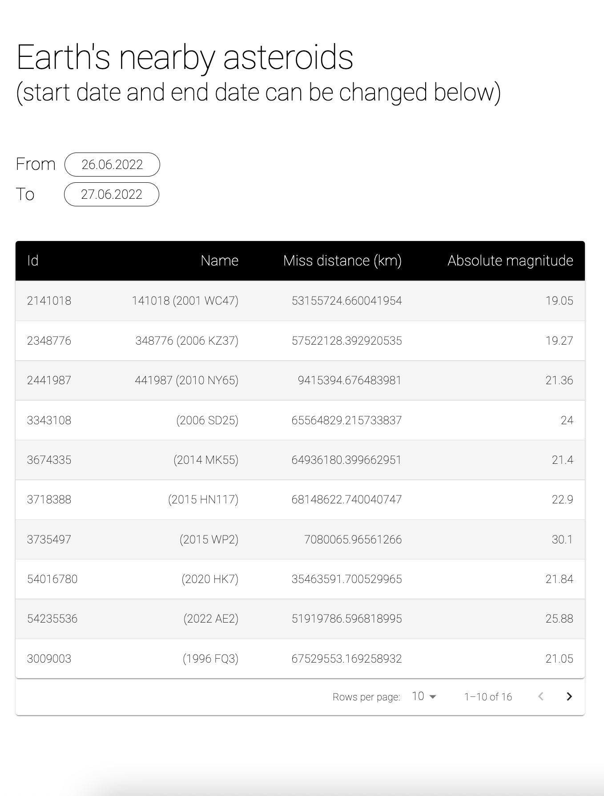

## NASA NEARBY ASTEROIDS

*TASK REQUIREMENTS*
- build a tool that can display data on nearby asteroids using NASA’s
APIs
- allow the end user to input a time period (start date and end date)
- output detailed information of the asteroid that passed closest to Earth during that time
period. For example, between 10th December 2015 and 31st December 2015, the closest
asteroid was: "id": "3738548", "name": "(2015 YJ)", "miss_distance.kilometers": "71228.647194367"
- set up at least a few tests to demonstrate your approach to testing
- front-end show-off: create front-end only
- front-end displays the data from the API in a
table, a chart, or in another visual representation form
- show off your design and accessibility
chops, or other aspects that you feel are important in front-end development

[Imre Bartis](mailto:imbartis@gmail.com)

## Proposed Solution

*SOLUTION DESCRIPTION*
- created the components structure
- fetched the https://api.nasa.gov/neo/rest/v1/feed?start_date=2015-09-07&end_date=2015-09-08&api_key=API_KEY data
- added types
- added a date picker library (pikaday) to enable users to change start date and end date from a calendar
- in the Table component I mapped the data to be displayed in the table rows
- added table pagination
- added style and a11y related tweaks
- added end-to-end tests

## Screenshots

## Libraries / Tools Used

- React.js
- Create React App for project setup
- Pikaday
- Moment
- Cypress
- MUI

## Setup

To install the dependencies run:

`npm install`

And to run the app:

`npm start`

## Running the tests

You can run the unit tests using:

`npm run cypress:open`

